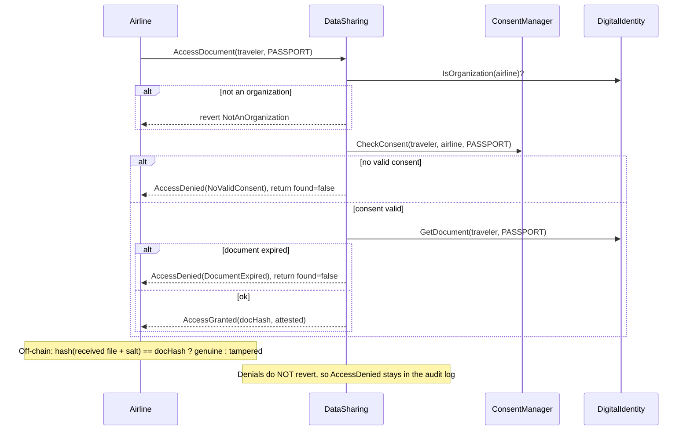

# Access Workflow

```mermaid
sequenceDiagram
    participant A as Airline
    participant DS as DataSharing
    participant CM as ConsentManager
    participant ID as DigitalIdentity

    A->>DS: AccessDocument(traveler, PASSPORT)
    DS->>ID: IsOrganization(airline)?
    alt not an organization
        DS-->>A: revert NotAnOrganization
    end
    DS->>CM: CheckConsent(traveler, airline, PASSPORT)
    alt no valid consent
        DS-->>A: AccessDenied(NoValidConsent), return found=false
    else consent valid
        DS->>ID: GetDocument(traveler, PASSPORT)
        alt document expired
            DS-->>A: AccessDenied(DocumentExpired), return found=false
        else ok
            DS-->>A: AccessGranted(docHash, attested)
        end
    end
    Note over A: Off-chain: hash(received file + salt) == docHash ? genuine : tampered
    Note over DS: Denials do NOT revert, so AccessDenied stays in the audit log
```
