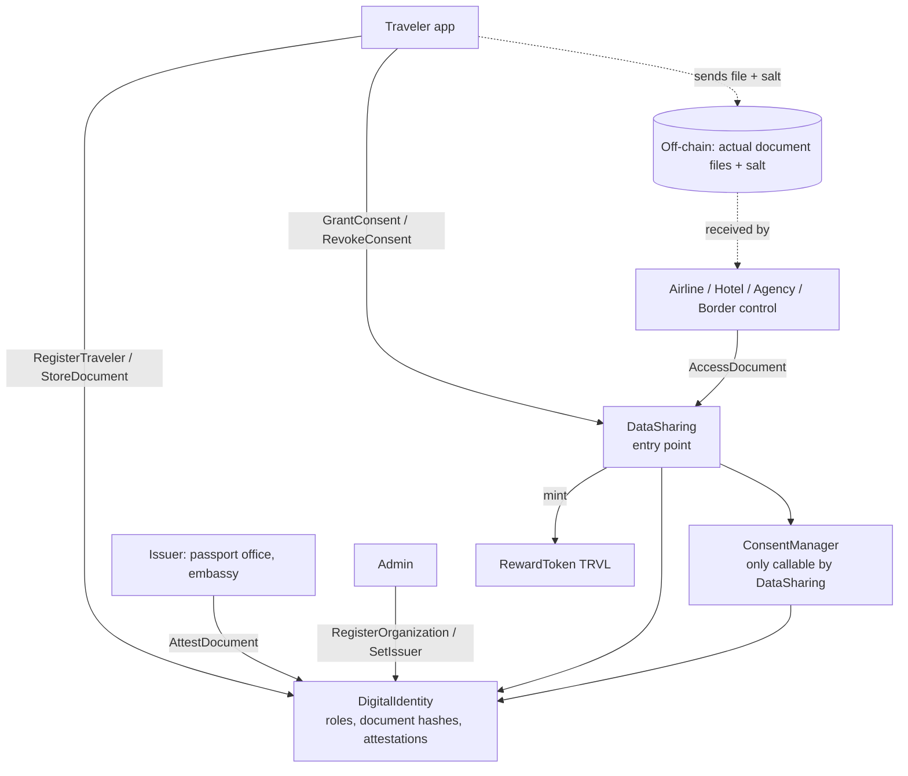
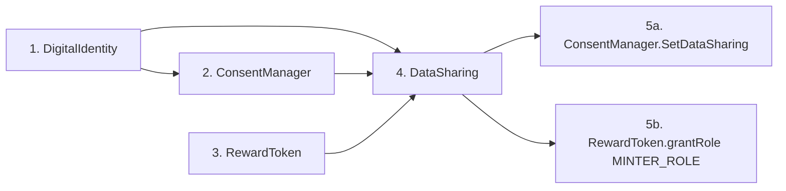

# TravelChain Architecture

## High-level

```mermaid
flowchart TB
    Traveler[Traveler app]
    Org[Airline / Hotel / Agency / Border control]
    Issuer[Issuer: passport office, embassy]
    Admin[Admin]

    DS[DataSharing<br/>entry point]
    CM[ConsentManager<br/>only callable by DataSharing]
    ID[DigitalIdentity<br/>roles, document hashes, attestations]
    TK[RewardToken TRVL]

    Files[(Off-chain: actual document files + salt)]

    Traveler -->|GrantConsent / RevokeConsent| DS
    Org -->|AccessDocument| DS
    Traveler -->|RegisterTraveler / StoreDocument| ID
    Issuer -->|AttestDocument| ID
    Admin -->|RegisterOrganization / SetIssuer| ID

    DS --> CM
    DS --> ID
    DS -->|mint| TK
    CM --> ID

    Traveler -. sends file + salt .-> Files
    Files -. received by .-> Org
```

## Deployment order and wiring

```mermaid
flowchart LR
    A[1. DigitalIdentity] --> B[2. ConsentManager]
    C[3. RewardToken]
    A --> D[4. DataSharing]
    B --> D
    C --> D
    D --> E[5a. ConsentManager.SetDataSharing]
    D --> F[5b. RewardToken.grantRole MINTER_ROLE]
```
