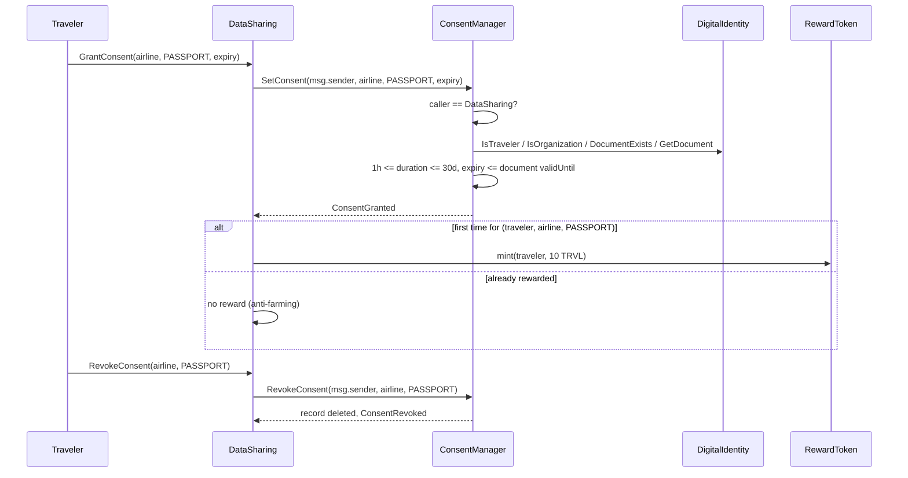

# Consent Workflow

```mermaid
sequenceDiagram
    participant T as Traveler
    participant DS as DataSharing
    participant CM as ConsentManager
    participant ID as DigitalIdentity
    participant TK as RewardToken

    T->>DS: GrantConsent(airline, PASSPORT, expiry)
    DS->>CM: SetConsent(msg.sender, airline, PASSPORT, expiry)
    CM->>CM: caller == DataSharing?
    CM->>ID: IsTraveler / IsOrganization / DocumentExists / GetDocument
    CM->>CM: 1h <= duration <= 30d, expiry <= document validUntil
    CM-->>DS: ConsentGranted
    alt first time for (traveler, airline, PASSPORT)
        DS->>TK: mint(traveler, 10 TRVL)
    else already rewarded
        DS->>DS: no reward (anti-farming)
    end

    T->>DS: RevokeConsent(airline, PASSPORT)
    DS->>CM: RevokeConsent(msg.sender, airline, PASSPORT)
    CM-->>DS: record deleted, ConsentRevoked
```
